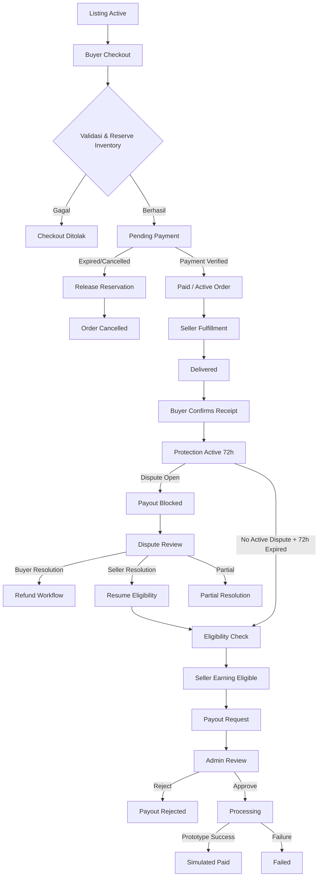
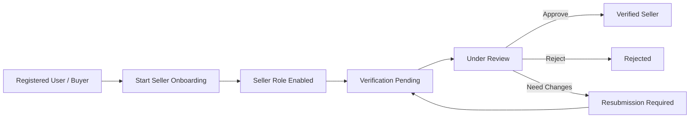
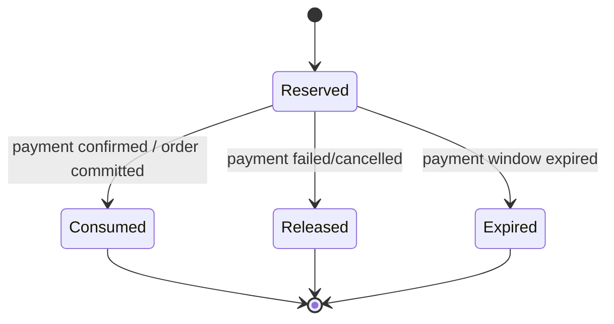

# ORIONTRUST — PRODUCT REQUIREMENTS DOCUMENT (PRD)

> **Dokumen produk utama untuk Local Prototype → Production Readiness**
>
> **Produk:** OrionTrust  
> **Kategori:** Multi-Category Digital Marketplace dengan Transaction Protection  
> **Versi PRD:** 1.0  
> **Bahasa:** Indonesia  
> **Status:** Baseline Produk — siap untuk review Product, Engineering, QA, Security, dan Operations  
> **Target tahap saat ini:** Local Prototype  
> **Target pasar awal:** Indonesia  
> **Pemilik produk:** Belum ditetapkan  
> **Target release date:** Belum ditetapkan  
> **Terakhir disusun:** 21 September 2026  

---

## Daftar Isi

1. [Tujuan dan Definisi PRD](#1-tujuan-dan-definisi-prd)
2. [Ringkasan Eksekutif](#2-ringkasan-eksekutif)
3. [Latar Belakang dan Masalah](#3-latar-belakang-dan-masalah)
4. [Visi Produk dan Prinsip Produk](#4-visi-produk-dan-prinsip-produk)
5. [Tujuan Produk dan Ukuran Keberhasilan](#5-tujuan-produk-dan-ukuran-keberhasilan)
6. [Ruang Lingkup](#6-ruang-lingkup)
7. [Pengguna, Persona, dan Hak Akses](#7-pengguna-persona-dan-hak-akses)
8. [Proposisi Nilai](#8-proposisi-nilai)
9. [Model Bisnis](#9-model-bisnis)
10. [Alur Pengguna Utama](#10-alur-pengguna-utama)
11. [Kebutuhan Fungsional](#11-kebutuhan-fungsional)
12. [State Model dan Transaction Invariants](#12-state-model-dan-transaction-invariants)
13. [Inventory dan Reservation](#13-inventory-dan-reservation)
14. [Payment, Protection, Dispute, Refund, dan Payout](#14-payment-protection-dispute-refund-dan-payout)
15. [Wallet dan Ledger](#15-wallet-dan-ledger)
16. [Kebutuhan Data](#16-kebutuhan-data)
17. [Kebutuhan Nonfungsional](#17-kebutuhan-nonfungsional)
18. [Security, Privacy, dan Compliance](#18-security-privacy-dan-compliance)
19. [UX, Accessibility, dan Content Requirements](#19-ux-accessibility-dan-content-requirements)
20. [Notifikasi, Invoice, Support, dan Reporting](#20-notifikasi-invoice-support-dan-reporting)
21. [Analytics dan Product Telemetry](#21-analytics-dan-product-telemetry)
22. [Acceptance Criteria dan Quality Gates](#22-acceptance-criteria-dan-quality-gates)
23. [Roadmap Delivery](#23-roadmap-delivery)
24. [Risiko dan Mitigasi](#24-risiko-dan-mitigasi)
25. [Dependencies, Assumptions, dan Constraints](#25-dependencies-assumptions-dan-constraints)
26. [Open Decisions](#26-open-decisions)
27. [Definition of Ready dan Definition of Done](#27-definition-of-ready-dan-definition-of-done)
28. [Traceability](#28-traceability)
29. [Referensi Riset](#29-referensi-riset)
30. [Atribusi Dokumen](#30-atribusi-dokumen)

---

# 1. Tujuan dan Definisi PRD

## 1.1 Apa itu PRD?

**Product Requirements Document (PRD)** adalah dokumen yang menjelaskan **produk apa yang perlu dibangun, untuk siapa produk tersebut dibuat, masalah apa yang diselesaikan, kapabilitas apa yang wajib tersedia, batas ruang lingkupnya, perilaku yang diharapkan, serta kriteria yang menentukan bahwa suatu release dianggap berhasil dan layak dirilis**.

PRD berfungsi sebagai **single source of truth tingkat produk** bagi Product, Design, Engineering, QA, Security, Operations, dan stakeholder bisnis.

> [!IMPORTANT]
> PRD **bukan** pengganti Technical Design Document (TDD), Software Architecture Document, ERD rinci, API contract, migration plan, atau source code. PRD mendefinisikan **WHAT + WHY + observable product behavior**. Detail **HOW** diputuskan melalui desain teknis/ADR selama tidak melanggar requirement dan invariant dalam PRD.

### PRD OrionTrust mengadopsi prinsip berikut

- Problem dan outcome harus jelas sebelum fitur.
- Scope dan out-of-scope harus eksplisit.
- Requirement harus dapat ditelusuri ke user need atau business rule.
- Requirement kritis harus mempunyai acceptance criteria.
- Kebutuhan keamanan, reliability, privacy, accessibility, dan auditability diperlakukan sebagai **product requirements**, bukan tambahan belakangan.
- Dokumen bersifat **living document**, tetapi perubahan terhadap business rule inti harus melalui review dan pencatatan keputusan.
- Technical implementation boleh berevolusi selama observable behavior dan invariant tetap benar.

---

# 2. Ringkasan Eksekutif

**OrionTrust** adalah marketplace multi-kategori untuk produk digital yang mempertemukan buyer dan seller dengan workflow transaksi terstruktur.

OrionTrust tidak hanya berfungsi sebagai katalog. Produk harus menyediakan lifecycle transaksi yang dapat ditelusuri sejak discovery hingga penyelesaian:

```text
Discovery
  → Listing
  → Checkout
  → Payment
  → Seller Fulfillment
  → Buyer Confirmation
  → 72-Hour Protection
  → Dispute / No Dispute
  → Settlement Eligibility
  → Seller Payout
```

Pada local prototype:

- pembayaran menggunakan **Mock Payment Provider**;
- refund bersifat **simulasi**;
- payout bersifat **simulasi**;
- tidak digunakan uang nyata;
- tidak digunakan KTP asli;
- tidak digunakan rekening payout nyata;
- data produk/credential sensitif menggunakan data dummy;
- platform **tidak boleh** menyatakan bahwa dana nyata sedang ditahan, diamankan, atau di-escrow.

OrionTrust harus menyediakan empat surface utama:

| Surface | Pengguna | Tujuan |
|---|---|---|
| Public Marketplace | Publik/Buyer | Discovery, search, filter, product detail |
| Buyer Center | Buyer | Checkout, order tracking, confirmation, dispute |
| Seller Center | Seller | Verification, listing, fulfillment, wallet, payout |
| Admin Panel | Staff/Admin/Super Admin | Moderation, verification, transaction ops, dispute, finance, audit |

---

# 3. Latar Belakang dan Masalah

## 3.1 Masalah Buyer

Buyer produk digital sering menghadapi:

- informasi produk yang tidak konsisten;
- sulit membedakan seller yang telah diverifikasi;
- status transaksi yang tidak terdokumentasi dengan baik;
- ketidakjelasan kapan produk dianggap diterima;
- tidak adanya periode pemeriksaan setelah penerimaan;
- jalur sengketa yang tidak terstruktur;
- potensi kebingungan terkait refund.

## 3.2 Masalah Seller

Seller membutuhkan:

- kanal listing yang konsisten;
- moderation workflow yang jelas;
- informasi status order;
- bukti bahwa fulfillment telah dicatat;
- visibilitas atas pendapatan, komisi, dan payout eligibility;
- proses payout yang dapat diaudit.

## 3.3 Masalah Operations/Admin

Admin membutuhkan:

- seller verification workflow;
- listing moderation;
- monitoring transaksi;
- catatan koordinasi dengan visibility yang jelas;
- dispute review;
- refund workflow;
- ledger dan reconciliation;
- audit trail;
- permission separation.

## 3.4 Problem Statement

> **Bagaimana OrionTrust dapat menyediakan marketplace produk digital dengan lifecycle transaksi yang jelas, aman, dapat diaudit, dan dapat dioperasikan secara konsisten oleh buyer, seller, serta staff—tanpa membuat klaim perlindungan dana yang melampaui kemampuan payment provider dan tanpa mencampur status transaksi yang berbeda?**

---

# 4. Visi Produk dan Prinsip Produk

## 4.1 Visi

> Menjadi platform transaksi produk digital yang memberikan kejelasan status, proses, tanggung jawab, dan perlindungan operasional kepada buyer serta seller melalui workflow yang terdokumentasi dan dapat diaudit.

## 4.2 Prinsip Produk

1. **Backend is authoritative**  
   Status, harga, fee, stock, eligibility, dan authorization ditentukan server.

2. **No hidden financial mutation**  
   Saldo tidak boleh berubah tanpa source event dan ledger entry.

3. **Explicit lifecycle**  
   Payment, delivery, protection, dispute, refund, dan payout adalah domain status yang berbeda.

4. **Least privilege**  
   Akses ditentukan berdasarkan role, permission, ownership, dan current state.

5. **Immutable historical truth**  
   Order menyimpan snapshot agar perubahan listing tidak mengubah histori transaksi.

6. **Prototype must be honest**  
   Mock payment, simulated refund, dan simulated payout harus berlabel jelas.

7. **Privacy by minimization**  
   Data pribadi dikumpulkan hanya jika dibutuhkan. KTP tidak disimpan di OrionTrust pada prototype.

8. **Auditability**  
   Keputusan administratif dan finansial yang penting harus dapat ditelusuri.

9. **Concurrency-safe**  
   Request ganda atau event bersamaan tidak boleh menghasilkan pembayaran, refund, stock consumption, ledger, atau payout ganda.

10. **Configuration over scattered hard-code**  
    Durasi, fee, dan aturan yang memang configurable harus memiliki satu sumber konfigurasi.

---

# 5. Tujuan Produk dan Ukuran Keberhasilan

## 5.1 Product Goals

| ID | Tujuan | Prioritas |
|---|---|---:|
| `G-01` | Buyer dapat menemukan dan membeli listing eligible | Must |
| `G-02` | Seller dapat diverifikasi, membuat listing, dan memenuhi order | Must |
| `G-03` | Lifecycle transaksi dapat dilacak end-to-end | Must |
| `G-04` | Protection 72 jam dimulai hanya setelah buyer confirmation | Must |
| `G-05` | Dispute aktif memblokir payout | Must |
| `G-06` | Semua nilai finansial dapat direkonsiliasi | Must |
| `G-07` | Admin dapat mengoperasikan sistem berdasarkan permission | Must |
| `G-08` | Prototype dapat diuji tanpa uang/data identitas asli | Must |
| `G-09` | Tidak ada akses lintas user akibat manipulasi identifier | Must |
| `G-10` | Sistem siap diintegrasikan ke provider nyata tanpa merombak core lifecycle | Should |

## 5.2 Success Metrics — Prototype

> [!NOTE]
> KPI bisnis production belum dapat ditetapkan tanpa data pasar/operasional. Pada tahap prototype, keberhasilan dinilai dari **correctness, safety, usability, dan testability**.

| Metric | Target Prototype |
|---|---:|
| Critical acceptance test pass rate | **100%** |
| Unauthorized cross-user access pada negative test | **0** |
| Duplicate financial side effect pada retry/idempotency test | **0** |
| Overselling pada concurrency test stock=1 | **0 kejadian** |
| Ledger transaction tidak seimbang | **0** |
| Payout eligible saat dispute aktif | **0** |
| Protection start sebelum buyer confirmation | **0** |
| KTP/credential/secret muncul di audit log | **0** |
| Mock payment route tersedia di production mode | **0 endpoint** |
| Critical flow dapat diselesaikan menggunakan keyboard | **Ya** |
| Order historis berubah akibat listing edit | **0** |

## 5.3 Future Production Metrics

Calon metrik production yang harus dikonfirmasi setelah discovery:

- checkout conversion rate;
- payment success rate;
- median seller fulfillment time;
- buyer confirmation rate;
- dispute rate per completed order;
- dispute resolution time;
- refund rate;
- payout processing time;
- support ticket rate per 100 orders;
- repeat buyer rate;
- active verified seller rate;
- failed payout rate;
- reconciliation discrepancy rate.

---

# 6. Ruang Lingkup

## 6.1 In Scope — Prototype v1

### Marketplace

- landing page;
- catalog;
- search;
- category filter;
- price filter;
- sorting;
- product detail;
- favorites.

### Identity & Access

- register;
- login/logout;
- password reset;
- email verification jika diaktifkan;
- buyer role default;
- seller onboarding;
- role dan permission;
- ownership policies.

### Seller

- verification application;
- listing CRUD;
- dynamic category attributes;
- listing moderation;
- stock/inventory handling;
- incoming orders;
- delivery status;
- wallet view;
- payout request simulation.

### Transaction

- single-listing order;
- order snapshot;
- inventory reservation;
- mock payment;
- fulfillment;
- buyer confirmation;
- 72-hour protection;
- dispute;
- simulated refund;
- ledger;
- payout eligibility;
- simulated payout.

### Admin

- dashboard;
- user management;
- seller verification;
- listing moderation;
- order monitoring;
- dispute management;
- refund management;
- finance/ledger;
- payout management;
- fees;
- reports;
- audit log;
- support tickets.

## 6.2 Explicit Out of Scope — Prototype v1

- uang nyata;
- escrow nyata;
- card data storage;
- KTP upload/storage;
- real bank payout;
- automatic identity verification;
- multi-seller cart;
- multi-listing checkout;
- crypto payment;
- lending/credit;
- BNPL;
- instant seller withdrawal;
- cross-border settlement;
- multi-currency settlement;
- automated fraud scoring berbasis ML;
- real credential vault untuk akun digital;
- mobile native application;
- public API untuk third party;
- automated legal/compliance determination.

> [!WARNING]
> Istilah pemasaran seperti **“escrow”**, **“dana ditahan OrionTrust”**, atau **“100% aman”** tidak boleh digunakan pada prototype kecuali secara faktual didukung provider dan hasil review legal/compliance.

---

# 7. Pengguna, Persona, dan Hak Akses

## 7.1 Persona

### Persona A — Buyer

**Tujuan:** menemukan produk, memahami biaya, melakukan transaksi, menerima produk, dan memperoleh jalur penyelesaian masalah.

**Kebutuhan utama:**

- informasi listing jelas;
- seller status terlihat;
- biaya transparan;
- timeline order;
- confirmation yang eksplisit;
- dispute path;
- invoice/history.

### Persona B — Seller

**Tujuan:** menjual produk digital secara terstruktur dan memahami status pendapatan.

**Kebutuhan utama:**

- onboarding;
- verification status;
- listing management;
- fulfillment workflow;
- fee visibility;
- payout eligibility;
- history.

### Persona C — Staff Operations

**Tujuan:** menangani proses operasional tanpa memiliki seluruh privilege administrator.

### Persona D — Admin

**Tujuan:** mengelola transaksi, users, moderation, disputes, dan finance sesuai permission.

### Persona E — Super Admin

**Tujuan:** mengelola permission, konfigurasi kritis, dan administrative governance.

## 7.2 Role ≠ Verification Status

```text
Role: seller
        │
        ├── verification=pending
        ├── verification=under_review
        ├── verification=approved
        └── verification=rejected
```

Seller role tidak berarti verified seller.

## 7.3 Permission Principles

| Capability | Buyer | Seller | Staff | Admin | Super Admin |
|---|---:|---:|---:|---:|---:|
| Browse products | ✅ | ✅ | ✅ | ✅ | ✅ |
| Buy eligible listing | ✅ | ✅* | ✅* | ✅* | ✅* |
| Buy own listing | ❌ | ❌ | ❌ | ❌ | ❌ |
| Create seller draft | — | ✅ | — | — | — |
| Publish approved listing | — | ✅ | — | — | — |
| Moderate listing | — | — | Permission | ✅ | ✅ |
| Resolve dispute | — | — | Permission | ✅ | ✅ |
| Approve payout | — | — | Permission | Permission | ✅ |
| Change roles | — | — | ❌ | Restricted | ✅ |

\* Hanya sebagai buyer terhadap listing milik seller lain dan tetap mengikuti policy.

---

# 8. Proposisi Nilai

## Buyer

- workflow transaksi yang jelas;
- biaya transparan;
- seller verification visibility;
- confirmation + protection period;
- dispute process terdokumentasi.

## Seller

- lifecycle listing dan order yang konsisten;
- informasi fee;
- pencatatan pendapatan;
- payout eligibility yang dapat dilacak.

## Operations

- satu sistem status yang menjadi sumber operasional;
- history dan audit;
- pembagian permission;
- dispute dan payout controls.

---

# 9. Model Bisnis

## 9.1 Revenue Components

OrionTrust memperoleh pendapatan dari:

1. **Seller commission**
2. **Buyer service fee**

### Formula

```text
buyer_total = item_price + buyer_service_fee

seller_commission = item_price × commission_rate

seller_net = item_price - seller_commission

platform_revenue = seller_commission + buyer_service_fee
```

## 9.2 Money Rules

- Prototype v1 menggunakan **IDR only**.
- Nilai uang disimpan dalam integer rupiah.
- Floating-point tidak boleh digunakan untuk business calculation.
- Fee dihitung server-side.
- Order menyimpan snapshot:
  - fee rate;
  - fee amount;
  - fee configuration reference/version;
  - price;
  - seller net;
  - buyer total.
- Perubahan fee hanya berlaku untuk order baru setelah effective time.

---

# 10. Alur Pengguna Utama

## 10.1 Canonical Transaction Flow



## 10.2 Seller Onboarding



Seller yang belum verified dapat mengakses:

- seller dashboard terbatas;
- verification;
- profile;
- draft listing jika kebijakan mengizinkan.

Seller yang belum verified **tidak** dapat membuat listing aktif yang dapat dibeli.

---

# 11. Kebutuhan Fungsional

## 11.1 Authentication & Account

| ID | Requirement | Priority |
|---|---|---:|
| `FR-AUTH-001` | User dapat register dengan nama, username, email, password, persetujuan Terms dan Privacy | Must |
| `FR-AUTH-002` | Role publik default adalah buyer | Must |
| `FR-AUTH-003` | Public registration tidak dapat memilih admin/staff/super-admin | Must |
| `FR-AUTH-004` | Login mendukung credential yang disetujui Product | Must |
| `FR-AUTH-005` | Logout mengakhiri session aktif | Must |
| `FR-AUTH-006` | Password reset menggunakan token berumur terbatas | Must |
| `FR-AUTH-007` | User dapat mengelola profile yang diizinkan | Must |
| `FR-AUTH-008` | Perubahan email membutuhkan verifikasi ulang bila fitur email verification aktif | Should |
| `FR-AUTH-009` | Administrative sensitive action dapat membutuhkan re-authentication/MFA di production | Must-Production |

## 11.2 Public Marketplace

| ID | Requirement | Priority |
|---|---|---:|
| `FR-CAT-001` | Landing page menampilkan category dan listing eligible | Must |
| `FR-CAT-002` | Catalog mendukung search, filter, sort, pagination | Must |
| `FR-CAT-003` | Hanya listing public-eligible yang dapat dibeli | Must |
| `FR-CAT-004` | Product detail menampilkan price, attributes, seller status, stock state, policy summary | Must |
| `FR-CAT-005` | Backend menghitung ulang price/fee saat checkout | Must |
| `FR-CAT-006` | Sorting parameter menggunakan whitelist | Must |
| `FR-CAT-007` | Buyer dapat favorite/unfavorite listing | Should |

## 11.3 Seller Verification

| ID | Requirement | Priority |
|---|---|---:|
| `FR-VER-001` | User dapat memulai seller onboarding | Must |
| `FR-VER-002` | Seller dapat submit verification application | Must |
| `FR-VER-003` | Admin/staff dapat assign reviewer dan memberikan decision | Must |
| `FR-VER-004` | Status minimum: pending, under_review, approved, rejected, resubmission_required | Must |
| `FR-VER-005` | Seller melihat decision note yang memang boleh ditampilkan | Must |
| `FR-VER-006` | OrionTrust prototype tidak menyimpan file/nomor KTP | Must |
| `FR-VER-007` | Semua verification decision sensitif diaudit | Must |

## 11.4 Listing

| ID | Requirement | Priority |
|---|---|---:|
| `FR-LST-001` | Verified seller dapat create/edit listing | Must |
| `FR-LST-002` | Listing menggunakan category schema tervalidasi | Must |
| `FR-LST-003` | Lifecycle listing mendukung draft, review, active, paused, sold-out, rejected, archived, suspended | Must |
| `FR-LST-004` | Seller hanya dapat memodifikasi listing miliknya | Must |
| `FR-LST-005` | Perubahan material dapat memicu re-review | Should |
| `FR-LST-006` | Historical order snapshot tidak berubah saat listing berubah | Must |
| `FR-LST-007` | Listing mendukung inventory type | Must |
| `FR-LST-008` | Gambar listing divalidasi server-side | Must |

## 11.5 Order

| ID | Requirement | Priority |
|---|---|---:|
| `FR-ORD-001` | Prototype v1 menggunakan **satu listing + satu seller per order** | Must |
| `FR-ORD-002` | Buyer tidak dapat membeli listing miliknya sendiri | Must |
| `FR-ORD-003` | Create order melakukan validasi listing, seller, stock, fee, dan snapshot | Must |
| `FR-ORD-004` | Order creation + reservation + payment initialization bersifat atomic sejauh berada pada local transaction boundary | Must |
| `FR-ORD-005` | Order memiliki public order number/identifier yang tidak bergantung pada sequential DB ID | Should |
| `FR-ORD-006` | Buyer hanya dapat melihat order miliknya | Must |
| `FR-ORD-007` | Seller hanya dapat melihat seller-side data untuk order miliknya | Must |
| `FR-ORD-008` | Admin dapat melihat order sesuai permission | Must |

## 11.6 Payment

| ID | Requirement | Priority |
|---|---|---:|
| `FR-PAY-001` | Prototype menggunakan `MockPaymentProvider` di belakang provider interface | Must |
| `FR-PAY-002` | Browser tidak dapat secara langsung menetapkan payment=paid | Must |
| `FR-PAY-003` | Amount, currency, order reference divalidasi server-side | Must |
| `FR-PAY-004` | Payment mutation memiliki idempotency protection | Must |
| `FR-PAY-005` | Duplicate provider event tidak menghasilkan duplicate side effect | Must |
| `FR-PAY-006` | Payment expiry melepaskan reservation bila order belum paid | Must |
| `FR-PAY-007` | Mock success/fail/expire route dinonaktifkan di production configuration | Must |

## 11.7 Fulfillment / Delivery

| ID | Requirement | Priority |
|---|---|---:|
| `FR-DLV-001` | Seller dapat menandai delivery setelah payment valid | Must |
| `FR-DLV-002` | Delivery record menyimpan method, status, timestamps, dan safe note | Must |
| `FR-DLV-003` | Prototype tidak menggunakan credential nyata | Must |
| `FR-DLV-004` | Credential tidak boleh masuk audit log, analytics, notification, atau unrestricted note | Must |
| `FR-DLV-005` | Production secure-delivery mechanism adalah keputusan terpisah | Must-Production |

## 11.8 Buyer Confirmation & Protection

| ID | Requirement | Priority |
|---|---|---:|
| `FR-PRT-001` | Buyer dapat confirm receipt hanya bila delivery valid | Must |
| `FR-PRT-002` | Confirmation meminta explicit user action | Must |
| `FR-PRT-003` | `buyer_confirmed_at` ditentukan server | Must |
| `FR-PRT-004` | Protection dimulai **setelah buyer confirmation**, bukan payment/delivery | Must |
| `FR-PRT-005` | Protection berdurasi tepat 72 jam | Must |
| `FR-PRT-006` | Time-based eligibility menggunakan timestamp authoritative, bukan hanya cached status | Must |
| `FR-PRT-007` | Prototype tidak auto-confirm receipt jika buyer tidak bertindak | Must |

## 11.9 Dispute

| ID | Requirement | Priority |
|---|---|---:|
| `FR-DSP-001` | Buyer eligible dapat membuka dispute | Must |
| `FR-DSP-002` | Open dispute secara atomic memblokir payout | Must |
| `FR-DSP-003` | Evidence private hanya dapat diakses authorized actors | Must |
| `FR-DSP-004` | Admin/staff dapat assign, review, request clarification, resolve | Must |
| `FR-DSP-005` | Resolution mendukung buyer, seller, partial | Must |
| `FR-DSP-006` | Resolution menghasilkan status + ledger/refund side effects yang konsisten | Must |

## 11.10 Refund

| ID | Requirement | Priority |
|---|---|---:|
| `FR-RFD-001` | Refund mempunyai record independen dari order status | Must |
| `FR-RFD-002` | Refund mempunyai amount, reason, status, source, actor, timestamps | Must |
| `FR-RFD-003` | Total successful refund tidak boleh melebihi refundable amount | Must |
| `FR-RFD-004` | Refund mutation idempotent | Must |
| `FR-RFD-005` | Refund completed menghasilkan ledger treatment | Must |
| `FR-RFD-006` | Prototype refund adalah simulasi | Must |

## 11.11 Wallet & Payout

| ID | Requirement | Priority |
|---|---|---:|
| `FR-WAL-001` | Wallet menampilkan pending, available, reserved, paid-out projection | Must |
| `FR-WAL-002` | Ledger adalah source of truth; wallet adalah projection/cache | Must |
| `FR-POT-001` | Seller hanya dapat request payout dari eligible balance | Must |
| `FR-POT-002` | Payout request melakukan reserve allocation secara atomic | Must |
| `FR-POT-003` | Payout menggunakan allocation ke source earning/order | Must |
| `FR-POT-004` | Duplicate payout processing dicegah | Must |
| `FR-POT-005` | Prototype payout status paid berarti simulated paid | Must |
| `FR-POT-006` | Payout destination prototype menggunakan dummy data | Must |

## 11.12 Admin

| ID | Requirement | Priority |
|---|---|---:|
| `FR-ADM-001` | Menu dan endpoint admin mengikuti permission | Must |
| `FR-ADM-002` | Hide menu bukan security control | Must |
| `FR-ADM-003` | User suspension tidak menghapus histori | Must |
| `FR-ADM-004` | Role escalation membutuhkan permission khusus | Must |
| `FR-ADM-005` | Finance adjustment melalui ledger adjustment/reversal, bukan edit balance | Must |
| `FR-ADM-006` | Sensitive actions tercatat dengan actor dan timestamp | Must |
| `FR-ADM-007` | Audit log menggunakan field allowlist/redaction | Must |

---

# 12. State Model dan Transaction Invariants

## 12.1 Domain Status

### Order

```text
pending_payment
active
completed
cancelled
closed
```

> Detail payment/dispute/refund/payout tidak perlu dipaksakan menjadi satu `order_status`.

### Payment

```text
unpaid
pending
paid
failed
expired
refunded
partially_refunded
```

### Delivery

```text
not_started
in_progress
delivered
delivery_failed
confirmed_received
```

### Protection

```text
not_started
active
expired
blocked
released
```

### Dispute

```text
none
open
under_review
resolved_buyer
resolved_seller
resolved_partial
closed
```

### Payout

```text
not_eligible
eligible
requested
under_review
approved
processing
paid
rejected
cancelled
failed
blocked
```

## 12.2 Core Transaction Invariants

> [!CAUTION]
> Invariant berikut adalah **non-negotiable product rules**. Implementasi yang melanggarnya dianggap defect kritis walaupun UI terlihat bekerja.

1. Unpaid order tidak boleh masuk fulfillment.
2. Buyer tidak boleh membeli listing miliknya sendiri.
3. Protection tidak boleh dimulai sebelum buyer confirmation.
4. Buyer confirmation tidak boleh diterima sebelum delivery valid.
5. `protection_ends_at = protection_started_at + 72 hours`.
6. Active dispute selalu memblokir payout terkait.
7. Payout request tidak boleh melebihi seller eligible balance.
8. Reserved payout balance tidak boleh digunakan oleh payout request lain.
9. Successful refunds secara kumulatif tidak boleh melebihi refundable amount.
10. Posted ledger transaction harus seimbang.
11. Posted ledger entry tidak boleh dihapus.
12. Duplicate payment event tidak boleh menghasilkan double posting.
13. Duplicate confirmation tidak boleh memulai dua protection periods.
14. Stock/reservation tidak boleh menghasilkan available stock negatif.
15. Historical order snapshot tidak boleh berubah akibat edit listing/category/fee.
16. Client tidak pernah menjadi authority untuk price, fee, seller, stock, eligibility, payment status, atau payout status.
17. Scheduler tidak boleh menjadi satu-satunya dasar waktu; timestamp tetap authoritative.
18. Mock endpoints harus tidak dapat digunakan dalam production mode.
19. Sensitive evidence/credential tidak boleh dipublikasikan melalui public storage.
20. Sequential/public identifier complexity tidak pernah menggantikan object-level authorization.

## 12.3 Atomic Financial/Eligibility Operations

Operasi berikut wajib melakukan **re-check current state** pada transactional boundary dan menggunakan locking/concurrency control yang sesuai:

- create inventory reservation;
- consume/release inventory reservation;
- mark payment paid;
- confirm receipt;
- open dispute;
- expire protection / mark earning eligible;
- create refund;
- finalize refund;
- create payout request;
- allocate balance to payout;
- mark payout paid/failed;
- ledger posting/reversal.

---

# 13. Inventory dan Reservation

## 13.1 Inventory Types

| Type | Use Case | Stock Semantics |
|---|---|---|
| `unique` | akun digital unik, lisensi unik | quantity umumnya 1 |
| `quantity` | voucher/code dengan multiple units | stock decrement |
| `on_demand` | top-up/service manual | tidak bergantung pre-stock unit |

## 13.2 Reservation Lifecycle



## 13.3 Reservation Requirements

- Reservation terkait satu order.
- Reservation mempunyai `reserved_at` dan `expires_at`.
- Stock availability dihitung dengan mempertimbangkan active reservations.
- Competing checkout untuk last unit harus menghasilkan **maksimal satu reservation berhasil**.
- Expiry/release bersifat idempotent.

---

# 14. Payment, Protection, Dispute, Refund, dan Payout

## 14.1 Mock Payment

Mock provider minimal mendukung:

- create payment;
- success simulation;
- fail simulation;
- expire simulation;
- refund simulation;
- status query.

> [!IMPORTANT]
> Mock provider adalah development tool, bukan payment service.

## 14.2 Provider Abstraction

Contoh kontrak konseptual:

```php
interface PaymentProviderInterface
{
    public function createPayment(PaymentRequest $request): PaymentResult;
    public function getPaymentStatus(string $reference): PaymentStatusResult;
    public function requestRefund(RefundRequest $request): RefundResult;
}
```

PRD tidak mengunci signature final. Engineering dapat menetapkan interface final melalui TDD/ADR.

## 14.3 Protection Boundary

All transactional timestamps disimpan secara konsisten dalam **UTC**.

UI default Indonesia menampilkan **Asia/Jakarta (WIB)**.

Contoh:

```text
Buyer confirmation:
2026-09-10 07:00:00 UTC
= 2026-09-10 14:00:00 WIB

Protection end:
2026-09-13 07:00:00 UTC
= 2026-09-13 14:00:00 WIB
```

Eligibility:

```text
now < protection_ends_at   → protection masih aktif
now >= protection_ends_at  → dapat masuk eligibility evaluation
```

## 14.4 Race Condition Requirement

Skenario berikut tidak boleh menghasilkan inconsistent result:

```text
13:59:59.999 → dispute request
14:00:00.000 → protection expiry evaluation
```

Sistem harus menentukan hasil berdasarkan atomic transaction + authoritative timestamps + current-state re-check.

---

# 15. Wallet dan Ledger

## 15.1 Accounting Principle

```text
Ledger = Source of Truth
Wallet = Derived Projection / Cache
```

Jika wallet projection berbeda dengan ledger, hasil reconciliation harus menganggap ledger sebagai sumber kebenaran.

## 15.2 Ledger Model

PRD mensyaratkan dua konsep:

### Ledger Transaction

Mewakili satu business event finansial:

```text
payment_received
seller_earning_accrual
platform_fee
refund
payout_reservation
payout
reversal
adjustment
```

### Ledger Entries

Setiap ledger transaction terdiri dari debit/credit entries dan harus seimbang.

```text
SUM(DEBIT) == SUM(CREDIT)
```

## 15.3 Ledger Rules

- posted transaction immutable;
- correction via reversal/adjustment;
- every posting has source reference;
- every financial mutation has idempotency protection;
- currency explicit;
- reconciliation command/report tersedia;
- manual SQL balance edit bukan business workflow.

## 15.4 Payout Allocation

Payout request harus memiliki allocation terhadap eligible earning/source order.

Contoh:

```text
Seller eligible:
Order A → 95.000
Order B → 190.000
Order C → 95.000

Request payout → 200.000

Allocation:
Order A → 95.000
Order B → 105.000
```

Allocation mencegah ambiguity jika sebagian earning kemudian terkena hold/dispute/reversal.

---

# 16. Kebutuhan Data

## 16.1 Core Entities

| Domain | Entity |
|---|---|
| Identity | users, roles, permissions |
| Seller | seller_verifications, verification_logs |
| Catalog | categories, listings, listing_images, moderation_logs |
| Inventory | inventory_reservations |
| Order | orders, order_status_histories |
| Payment | payments, provider_events |
| Delivery | delivery_records |
| Dispute | disputes, dispute_evidences, dispute_logs |
| Refund | refunds |
| Finance | ledger_transactions, ledger_entries, wallets |
| Payout | payout_requests, payout_allocations, payout_destinations |
| Operations | order_notes, support_tickets, notifications |
| Governance | audit_logs, fee_settings |

## 16.2 Order Snapshot

Snapshot minimal menyimpan:

- listing public identifier;
- title;
- category;
- selected attributes;
- seller reference;
- quantity;
- unit price;
- item subtotal;
- buyer service fee;
- seller commission rate;
- seller commission amount;
- seller net;
- buyer total;
- currency;
- fee configuration/version.

## 16.3 Data Classification

| Kelas | Contoh | Perlakuan |
|---|---|---|
| Public | listing title, public price | dapat dipublikasikan |
| Internal | admin operational notes | restricted |
| Personal | email, phone | access-controlled |
| Sensitive Financial | payout destination | encrypted/masked |
| Sensitive Evidence | dispute files | private authorized access |
| Secret | API key, provider secret | secrets manager/env, never logs |
| Prohibited in prototype | KTP file/number, real credential | tidak dikumpulkan |

---

# 17. Kebutuhan Nonfungsional

## 17.1 Security

| ID | Requirement |
|---|---|
| `NFR-SEC-001` | Object-level authorization pada setiap protected resource |
| `NFR-SEC-002` | CSRF protection untuk browser state-changing requests |
| `NFR-SEC-003` | Password menggunakan framework-supported secure hashing |
| `NFR-SEC-004` | Session fixation mitigated via regeneration pada login |
| `NFR-SEC-005` | Sensitive admin actions dapat memerlukan MFA/re-auth |
| `NFR-SEC-006` | Private file access selalu melalui authorization |
| `NFR-SEC-007` | Secrets tidak berada di source code/log |
| `NFR-SEC-008` | Input server-side validation pada semua write actions |
| `NFR-SEC-009` | Livewire/client state dianggap untrusted |
| `NFR-SEC-010` | Audit log melakukan redaction/allowlisting |

## 17.2 Reliability & Consistency

| ID | Requirement |
|---|---|
| `NFR-REL-001` | Financial and inventory mutations idempotent where retry is possible |
| `NFR-REL-002` | Critical jobs aman untuk retry |
| `NFR-REL-003` | Scheduler job tidak menghasilkan duplicate financial posting |
| `NFR-REL-004` | Transactional state changes tahan concurrent requests |
| `NFR-REL-005` | Failed jobs observable dan dapat diretry |
| `NFR-REL-006` | Backup dan recovery policy wajib sebelum production |

## 17.3 Performance — Prototype Baseline

Target final production ditetapkan setelah load profile tersedia.

Prototype baseline:

- catalog menggunakan pagination;
- tidak ada N+1 query pada critical list;
- expensive report tidak memblok request interaktif;
- image/file limits diterapkan;
- DB index pada lookup/status/filter utama;
- queue digunakan untuk pekerjaan async yang tepat.

## 17.4 Maintainability

- modular monolith;
- business logic tidak tersebar di Blade/controller;
- state mutation melalui action/service yang terkontrol;
- status/enum terpusat;
- fee/configuration terpusat;
- critical flow memiliki automated tests;
- architecture decision penting didokumentasikan.

## 17.5 Compatibility

Browser production target harus ditetapkan sebelum release. Prototype minimum:

- current Chromium-based browser;
- Firefox current;
- Safari current jika target pengguna mencakup Apple ecosystem.

---

# 18. Security, Privacy, dan Compliance

## 18.1 Security Baseline

Target baseline: praktik keamanan Laravel/framework + OWASP ASVS yang sesuai risk profile marketplace.

Security review wajib mencakup:

- authentication;
- authorization;
- session management;
- business logic;
- file handling;
- cryptography;
- logging;
- data protection;
- webhook/API security;
- dependency security;
- secure configuration.

## 18.2 Privacy Requirements

- data minimization;
- purpose limitation;
- access restriction;
- deletion/retention policy sebelum production;
- secure processing;
- personal data inventory;
- incident response;
- lawful processing review sebelum production;
- vendor/processor review jika menggunakan third-party.

## 18.3 Indonesia Production Gate

Sebelum production, OrionTrust harus melakukan review hukum/compliance terhadap setidaknya:

- **UU No. 27 Tahun 2022 tentang Pelindungan Data Pribadi**;
- **PP No. 71 Tahun 2019 tentang Penyelenggaraan Sistem dan Transaksi Elektronik**;
- kewajiban/ketentuan **PSE Lingkup Privat** yang berlaku;
- regulasi **Bank Indonesia** yang relevan bila model bisnis masuk aktivitas sistem pembayaran;
- ketentuan perlindungan konsumen yang relevan;
- terms/payment-provider agreement.

> [!WARNING]
> PRD ini **bukan legal opinion**. Keputusan apakah OrionTrust membutuhkan izin, struktur kerja sama tertentu, atau perubahan model dana harus ditentukan melalui legal/compliance review berdasarkan model production yang final.

## 18.4 Payment Regulatory Gate

Production tidak boleh diaktifkan hanya karena mock flow lulus.

Go-live payment membutuhkan:

- provider dipilih;
- legal model aliran dana ditetapkan;
- capability provider diverifikasi;
- webhook + reconciliation plan;
- refund/payout mechanism;
- Terms/Privacy/Refund/Dispute policies;
- consumer disclosure;
- operational incident plan.

---

# 19. UX, Accessibility, dan Content Requirements

## 19.1 UX Principles

- status selalu menggunakan bahasa manusia yang jelas;
- action destructive/sensitive meminta confirmation;
- biaya terlihat sebelum final checkout;
- mock/simulation labels terlihat;
- error menjelaskan langkah perbaikan;
- empty states informatif;
- timeline order mudah dipahami;
- admin internal note dibedakan jelas dari buyer/seller-visible note.

## 19.2 Accessibility Baseline

Target practical baseline: **WCAG 2.2 AA**.

Minimum:

- keyboard navigation;
- visible focus;
- semantic heading hierarchy;
- explicit form labels;
- error association;
- accessible modal focus management;
- status feedback yang dapat dipahami assistive technology;
- adequate color contrast;
- action tidak bergantung warna saja.

## 19.3 Content Rules

Dilarang membuat klaim yang tidak didukung sistem/provider, termasuk:

- “100% aman”;
- “dana dijamin OrionTrust”;
- “escrow resmi” tanpa dasar;
- “refund pasti” tanpa syarat;
- “seller terjamin tidak bermasalah”.

Gunakan wording berbasis proses:

> “Transaksi memiliki periode perlindungan 72 jam setelah konfirmasi penerimaan buyer. Sengketa yang memenuhi ketentuan dapat diajukan sesuai kebijakan OrionTrust.”

---

# 20. Notifikasi, Invoice, Support, dan Reporting

## 20.1 Notification Events

- account registration;
- email verification;
- seller verification submitted/result;
- listing approved/rejected;
- order created;
- payment result;
- delivery update;
- buyer confirmation;
- protection expiry/eligibility;
- dispute opened/updated/resolved;
- refund update;
- payout eligible;
- payout request update.

Sensitive data tidak boleh dimasukkan dalam body notification yang tidak diperlukan.

## 20.2 Invoice

Invoice bersumber dari immutable order snapshot.

Invoice minimum:

- invoice number;
- order number;
- date;
- item summary;
- price;
- buyer fee;
- total;
- payment status;
- platform identity fields yang diperlukan.

## 20.3 Support Ticket

User login dapat:

- create ticket;
- memilih category;
- melihat status;
- membalas;
- mengakses hanya ticket miliknya.

Staff/admin dapat menangani berdasarkan permission.

## 20.4 Reporting Definitions

Jangan gunakan istilah finansial tanpa definisi.

### GMV

Report wajib membedakan:

```text
GMV Created
GMV Paid
GMV Completed
GMV Refunded
```

### Platform Revenue

Report production harus membedakan:

```text
Accrued Fee
Recognized Revenue
Refunded/Reversed Fee
```

Recognition point final adalah **OPEN DECISION** untuk finance/accounting review.

---

# 21. Analytics dan Product Telemetry

## 21.1 Event Naming

Contoh taxonomy:

```text
product_viewed
checkout_started
order_created
payment_succeeded
payment_failed
seller_delivery_marked
buyer_receipt_confirmed
protection_started
dispute_opened
dispute_resolved
refund_processed
payout_requested
payout_processed
```

## 21.2 Analytics Data Rules

Analytics tidak boleh menerima:

- password;
- auth token;
- provider secret;
- full payout destination;
- dispute evidence raw data;
- credentials produk;
- KTP;
- unrestricted admin note.

## 21.3 Operational Telemetry

System telemetry minimum production:

- queue backlog;
- failed jobs;
- scheduler health;
- payment event failures;
- reconciliation discrepancies;
- error rate;
- latency;
- DB health;
- storage health;
- security-relevant auth failures.

---

# 22. Acceptance Criteria dan Quality Gates

## 22.1 Business Acceptance

- [ ] Buyer dapat register/login.
- [ ] User tidak dapat self-assign admin role.
- [ ] Seller onboarding dan manual verification bekerja.
- [ ] KTP tidak tersimpan di OrionTrust.
- [ ] Seller dapat mengelola listing miliknya.
- [ ] Pending/rejected/paused listing tidak dapat dibeli.
- [ ] Buyer tidak dapat membeli listing miliknya sendiri.
- [ ] Order memiliki immutable snapshot.
- [ ] Inventory reservation mencegah oversell.
- [ ] Mock payment success/fail/expire bekerja.
- [ ] Frontend tidak dapat memaksa payment=paid.
- [ ] Seller fulfillment membutuhkan valid payment.
- [ ] Buyer confirmation memulai protection 72 jam.
- [ ] Dispute memblokir payout.
- [ ] Refund menghasilkan consistent financial state.
- [ ] Ledger selalu seimbang.
- [ ] Payout tidak melebihi eligible balance.
- [ ] Payout simulation berlabel jelas.
- [ ] Admin actions mengikuti permission.
- [ ] Invoice dibuat dari order snapshot.
- [ ] Audit log tidak menyimpan prohibited sensitive data.

## 22.2 Concurrency Acceptance

- [ ] Dua buyer checkout stock=1 secara simultan → maksimal satu reservation berhasil.
- [ ] Dua payment success event identik → satu side effect finansial.
- [ ] Dua buyer-confirm requests → satu confirmation.
- [ ] Protection expiry bersamaan dispute → tidak menghasilkan payout eligible yang salah.
- [ ] Dua payout requests terhadap balance yang sama → tidak terjadi double reservation.
- [ ] Refund dan payout yang konflik → satu operasi harus melihat current locked state sebelum commit.

## 22.3 Security Acceptance

- [ ] Buyer A tidak dapat membaca Order Buyer B.
- [ ] Seller A tidak dapat edit Listing Seller B.
- [ ] UUID/public ID tetap memerlukan authorization.
- [ ] Evidence private tidak dapat dibuka tanpa authorization.
- [ ] Mock payment endpoints unavailable pada production config.
- [ ] Mass assignment tidak dapat mengubah role/owner/financial fields.
- [ ] Secret tidak terdapat dalam repository/log.
- [ ] File upload type/size tervalidasi.
- [ ] Admin sensitive action tercatat.

## 22.4 Release Blockers

Release **tidak boleh** dinyatakan selesai jika salah satu berikut masih terjadi:

```text
P0 / RELEASE BLOCKER
- unauthorized data access
- double charge/double posting simulation
- negative/incorrect wallet akibat race
- payout while active dispute
- protection starts before buyer confirmation
- overselling unique item
- mock route enabled in production
- sensitive credential/KTP/secret in logs
- unbalanced posted ledger
```

---

# 23. Roadmap Delivery

| Fase | Fokus | Exit Criteria |
|---|---|---|
| 1 | Foundation & Auth | roles, policies, layout, migrations, seed, tests |
| 2 | Catalog | public pages, search/filter, product detail |
| 3 | Seller | onboarding, verification, listing, moderation |
| 4 | Order & Mock Payment | snapshot, reservation, payment, fulfillment |
| 5 | Protection & Finance | 72h, ledger, wallet, payout simulation |
| 6 | Dispute & Admin Ops | disputes, refunds, finance/admin controls |
| 7 | Notification & Reporting | invoice, notification, reporting, UX polish |
| 8 | QA & Production Readiness | security, concurrency, compliance, runbook |

---

# 24. Risiko dan Mitigasi

| Risiko | Dampak | Likelihood | Mitigasi |
|---|---|---:|---|
| Race condition stock | High | Medium | reservation + transaction + locking |
| Duplicate payment/refund | Critical | Medium | idempotency + provider event uniqueness |
| Incorrect payout eligibility | Critical | Medium | state guard + timestamps + lock |
| Cross-user data access | Critical | Medium | policies + object-level authorization tests |
| Sensitive log leakage | High | Medium | allowlist logging + redaction |
| Seller fraud/product dispute | High | High | verification + moderation + dispute process |
| Credential leakage | Critical | Medium | prototype dummy-only; secure delivery design for production |
| Misleading escrow claim | High | Medium | product copy governance |
| Provider dependency | High | Medium | adapter + provider abstraction |
| Legal model mismatch | Critical | Medium | production legal/compliance gate |
| Wallet drift | High | Medium | ledger source-of-truth + reconciliation |
| Admin privilege abuse | High | Low/Medium | RBAC + MFA + audit + least privilege |

---

# 25. Dependencies, Assumptions, dan Constraints

## 25.1 Dependencies

- Laravel ecosystem;
- MySQL/InnoDB;
- Blade;
- Livewire;
- Tailwind CSS;
- mail/notification infrastructure;
- queue/scheduler;
- private file storage;
- payment provider production — **TBD**;
- payout mechanism production — **TBD**.

## 25.2 Assumptions

- prototype berjalan lokal;
- data dummy tersedia;
- satu order hanya memiliki satu seller;
- currency prototype IDR;
- staff melakukan manual seller verification;
- admin/staff menjadi operational coordinator;
- WhatsApp dapat digunakan sebagai kanal koordinasi tambahan, tetapi sistem OrionTrust tetap authority untuk status transaksi.

## 25.3 Constraints

- no real KTP in prototype;
- no real money in prototype;
- no real payout account in prototype;
- no claim of real fund custody;
- tech version major harus dipin di TDD/ADR sebelum coding production-grade;
- perubahan business invariant membutuhkan Product approval.

---

# 26. Open Decisions

| ID | Decision | Status |
|---|---|---|
| `OD-01` | Payment provider production | Open |
| `OD-02` | Mekanisme legal aliran/settlement dana | Open |
| `OD-03` | Final seller commission | Open |
| `OD-04` | Final buyer service fee | Open |
| `OD-05` | Payment expiry duration | Open |
| `OD-06` | Seller fulfillment SLA | Open |
| `OD-07` | Dispute filing deadline | Open |
| `OD-08` | Buyer auto-confirm policy | Open |
| `OD-09` | Minimum payout | Open |
| `OD-10` | Payout frequency | Open |
| `OD-11` | Refund policy after completed payout | Open |
| `OD-12` | Seller negative balance/debt policy | Open |
| `OD-13` | Secure digital credential delivery mechanism | Open-Production |
| `OD-14` | Payout destination verification/cooldown | Open |
| `OD-15` | Seller verification expiration/reverification | Open |
| `OD-16` | Material listing changes that trigger re-review | Open |
| `OD-17` | Minimum/maximum listing price | Open |
| `OD-18` | Maximum quantity per order | Open |
| `OD-19` | Revenue recognition point | Open |
| `OD-20` | Dispute evidence retention | Open |
| `OD-21` | User deletion/anonymization policy with financial history | Open |
| `OD-22` | Production hosting/region/backup topology | Open |
| `OD-23` | Browser support matrix | Open |
| `OD-24` | Admin MFA mechanism | Open-Production |
| `OD-25` | Final major versions PHP/Laravel/Livewire/Tailwind/MySQL | Open Technical Decision |

---

# 27. Definition of Ready dan Definition of Done

## 27.1 Definition of Ready

Sebuah feature siap masuk implementation jika:

- [ ] requirement ID tersedia;
- [ ] user/problem jelas;
- [ ] acceptance criteria tersedia;
- [ ] scope/out-of-scope jelas;
- [ ] dependency diketahui;
- [ ] authorization rule diketahui;
- [ ] data sensitivity diketahui;
- [ ] state transition diketahui bila relevan;
- [ ] analytics event ditentukan bila relevan;
- [ ] unresolved blocking product decision = 0.

## 27.2 Definition of Done

Feature dianggap selesai jika:

- [ ] implementation selesai;
- [ ] code review selesai;
- [ ] authorization test lulus;
- [ ] validation test lulus;
- [ ] happy-path test lulus;
- [ ] negative-path test lulus;
- [ ] concurrency/idempotency test lulus bila relevan;
- [ ] no critical security defect;
- [ ] accessible interaction diverifikasi;
- [ ] user-facing copy final;
- [ ] audit/analytics behavior benar;
- [ ] documentation diperbarui;
- [ ] PRD/ADR disinkronkan bila terjadi approved change.

---

# 28. Traceability

Gunakan requirement ID di:

- issue/epic;
- branch/PR description;
- automated test name;
- QA test case;
- release note internal;
- architecture decision yang relevan.

Contoh:

```text
Epic: Seller Payout

Requirements:
- FR-POT-001
- FR-POT-002
- FR-POT-003
- NFR-REL-001
- NFR-SEC-001

Tests:
- payout_rejects_amount_above_eligible_balance
- payout_reserves_balance_atomically
- payout_duplicate_request_is_idempotent
- payout_blocked_when_dispute_open
```

### Traceability Matrix — Contoh

| Requirement | UX | Backend | Data | Test |
|---|---|---|---|---|
| `FR-PRT-004` | Confirm receipt UI | Protection Action | order timestamps | protection_start_test |
| `FR-DSP-002` | Dispute status | OpenDispute Action | dispute + payout state | dispute_race_test |
| `FR-POT-002` | Payout form | CreatePayout Action | allocation | double_payout_test |
| `FR-ORD-004` | Checkout | CreateOrder Action | order + reservation | oversell_test |

---

# 29. Referensi Riset

> [!NOTE]
> Referensi berikut digunakan untuk memvalidasi struktur PRD, requirement engineering, quality model, security, accessibility, reliability, idempotency, serta konteks regulasi Indonesia. Ini bukan berarti setiap dokumen menjadi kewajiban hukum bagi OrionTrust.

## 29.1 PRD, Product Management, dan Requirements

1. [Atlassian — Product Requirements](https://www.atlassian.com/agile/product-management/requirements)
2. [Atlassian/Confluence — Product Requirements Document Template](https://www.atlassian.com/software/confluence/templates/product-requirements)
3. [Figma — How to Create a Product Requirements Document](https://www.figma.com/resource-library/product-requirements-document/)
4. [Figma/FigJam — PRD Template](https://www.figma.com/templates/prd-template/)
5. [Productboard — Product Requirements Document](https://www.productboard.com/glossary/product-requirements-document/)
6. [ProductPlan — Product Requirements Document](https://www.productplan.com/glossary/product-requirements-document)
7. [ProductPlan — Product Specs](https://www.productplan.com/glossary/product-specs)
8. [ProductPlan — Market Requirements Document](https://www.productplan.com/glossary/market-requirements-document)
9. [ProductPlan — Documentation](https://www.productplan.com/glossary/documentation)
10. [Aha! — Product Requirements Document Template](https://www.aha.io/roadmapping/guide/templates/create/prd)
11. [Miro — PRD Template](https://miro.com/templates/prd/)
12. [Miro — How to Write a PRD](https://miro.com/product-development/how-to-write-a-prd/)
13. [Product School — PRD Template](https://productschool.com/resources/templates/prd)
14. [airfocus by Lucid — Product Requirements Document](https://airfocus.com/glossary/what-is-product-requirements-document/)
15. [Notion — Product Requirements Doc Template](https://www.notion.com/templates/product-requirement-document-prd)
16. [Notion — PRD Template Category](https://www.notion.com/templates/category/product-requirements-doc)
17. [Wrike — Product Requirements Documents](https://www.wrike.com/product-management-guide/product-requirements-documents/)
18. [Wrike — Product Specifications](https://www.wrike.com/product-management-guide/faq/how-to-define-product-specifications/)
19. [Wrike — Software Requirements](https://www.wrike.com/product-management-guide/faq/how-to-write-software-requirements/)
20. [Figma — Product Development Process](https://www.figma.com/resource-library/product-development-process/)
21. [ISO/IEC 25010:2023 — Product Quality Model](https://www.iso.org/standard/78176.html)

## 29.2 Application Security

22. [OWASP — Application Security Verification Standard](https://owasp.org/projects/asvs)
23. [OWASP — Authorization Cheat Sheet](https://cheatsheetseries.owasp.org/cheatsheets/Authorization_Cheat_Sheet.html)
24. [OWASP — Authentication Cheat Sheet](https://cheatsheetseries.owasp.org/cheatsheets/Authentication_Cheat_Sheet.html)
25. [OWASP — Session Management Cheat Sheet](https://cheatsheetseries.owasp.org/cheatsheets/Session_Management_Cheat_Sheet.html)
26. [OWASP — IDOR Prevention Cheat Sheet](https://cheatsheetseries.owasp.org/cheatsheets/Insecure_Direct_Object_Reference_Prevention_Cheat_Sheet.html)
27. [OWASP — Transaction Authorization Cheat Sheet](https://cheatsheetseries.owasp.org/cheatsheets/Transaction_Authorization_Cheat_Sheet.html)
28. [OWASP — CSRF Prevention Cheat Sheet](https://cheatsheetseries.owasp.org/cheatsheets/Cross-Site_Request_Forgery_Prevention_Cheat_Sheet.html)
29. [OWASP — Password Storage Cheat Sheet](https://cheatsheetseries.owasp.org/cheatsheets/Password_Storage_Cheat_Sheet.html)
30. [OWASP — Multifactor Authentication Cheat Sheet](https://cheatsheetseries.owasp.org/cheatsheets/Multifactor_Authentication_Cheat_Sheet.html)
31. [OWASP — Secrets Management Cheat Sheet](https://cheatsheetseries.owasp.org/cheatsheets/Secrets_Management_Cheat_Sheet.html)
32. [OWASP — Logging Cheat Sheet](https://cheatsheetseries.owasp.org/cheatsheets/Logging_Cheat_Sheet.html)
33. [OWASP — File Upload Cheat Sheet](https://cheatsheetseries.owasp.org/cheatsheets/File_Upload_Cheat_Sheet.html)
34. [OWASP — Input Validation Cheat Sheet](https://cheatsheetseries.owasp.org/cheatsheets/Input_Validation_Cheat_Sheet.html)
35. [OWASP — Mass Assignment Cheat Sheet](https://cheatsheetseries.owasp.org/cheatsheets/Mass_Assignment_Cheat_Sheet.html)
36. [OWASP — Cryptographic Storage Cheat Sheet](https://cheatsheetseries.owasp.org/cheatsheets/Cryptographic_Storage_Cheat_Sheet.html)
37. [OWASP — Database Security Cheat Sheet](https://cheatsheetseries.owasp.org/cheatsheets/Database_Security_Cheat_Sheet.html)
38. [OWASP — Error Handling Cheat Sheet](https://cheatsheetseries.owasp.org/cheatsheets/Error_Handling_Cheat_Sheet.html)

## 29.3 Identity, Secure Development, dan Reliability

39. [NIST SP 800-63B — Authentication and Lifecycle Management](https://csrc.nist.gov/pubs/sp/800/63/b/final)
40. [NIST SP 800-218 Rev.1 — Secure Software Development Framework](https://csrc.nist.gov/pubs/sp/800/218/r1/ipd)
41. [NIST — Cybersecurity Framework](https://www.nist.gov/cyberframework)
42. [NIST SP 800-207 — Zero Trust Architecture](https://csrc.nist.gov/pubs/sp/800/207/final)
43. [AWS Well-Architected — Idempotent Mutating Operations](https://docs.aws.amazon.com/wellarchitected/2025-02-25/framework/rel_prevent_interaction_failure_idempotent.html)
44. [Google Cloud Well-Architected — Operational Excellence](https://docs.cloud.google.com/architecture/framework/operational-excellence)
45. [Google Cloud Well-Architected — Reliability](https://docs.cloud.google.com/architecture/framework/reliability)
46. [Stripe — Idempotent Requests](https://docs.stripe.com/api/idempotent_requests)
47. [PayPal Developer — Webhooks / Signature Validation](https://developer.paypal.com/api/invoicing/webhooks/)

## 29.4 Accessibility

48. [W3C — WCAG 2.2](https://www.w3.org/TR/WCAG22/)
49. [W3C WAI — Accessibility Principles](https://www.w3.org/WAI/fundamentals/accessibility-principles/)
50. [W3C WAI — Labeling Controls](https://www.w3.org/WAI/tutorials/forms/labels/)
51. [W3C WAI — Validating Input](https://www.w3.org/WAI/tutorials/forms/validation/)
52. [W3C WAI — User Notification](https://www.w3.org/WAI/tutorials/forms/notifications/)
53. [W3C WAI — Modal Dialog Pattern](https://www.w3.org/WAI/ARIA/apg/patterns/dialog-modal/)
54. [W3C WAI — Keyboard Accessible](https://www.w3.org/WAI/WCAG22/Understanding/keyboard-accessible.html)

## 29.5 Framework, Database, dan Transaction Controls

55. [Laravel 12 — Encryption](https://laravel.com/framework/docs/12.x/encryption)
56. [Laravel 12 — Task Scheduling](https://laravel.com/framework/docs/12.x/scheduling)
57. [Laravel 12 — Queues](https://laravel.com/framework/docs/12.x/queues)
58. [Laravel 12 — Notifications](https://laravel.com/framework/docs/12.x/notifications)
59. [Livewire 3 — Locked Properties](https://livewire.laravel.com/docs/3.x/locked)
60. [Livewire 3 — Security](https://livewire.laravel.com/docs/3.x/security)
61. [Livewire 4 — Locked Attribute](https://livewire.laravel.com/docs/4.x/attribute-locked)
62. [MySQL 8.4 — CHECK Constraints](https://dev.mysql.com/doc/refman/8.4/en/create-table-check-constraints.html)

> **Catatan versi:** dokumentasi Laravel 12 yang diteliti saat ini menampilkan peringatan bahwa Laravel 12 bukan versi terbaru. Karena PRD tidak seharusnya mengunci solusi teknis tanpa keputusan arsitektur, major version final wajib dipin melalui Technical Decision/ADR sebelum implementation baseline dibekukan.

## 29.6 Indonesia — Data, PSE, Payment, Consumer Protection

63. [UU No. 27 Tahun 2022 — Pelindungan Data Pribadi (JDIH BPK)](https://peraturan.bpk.go.id/Details/229798/uu-no-27-tahun-2022)
64. [PP No. 71 Tahun 2019 — Penyelenggaraan Sistem dan Transaksi Elektronik](https://peraturan.bpk.go.id/Details/122030/pp-no-71-tahun-2019)
65. [Permenkominfo No. 5 Tahun 2020 — PSE Lingkup Privat](https://jdih.komdigi.go.id/produk_hukum/view/id/759/t/peraturan%2Bmenteri%2Bkomunikasi%2Bdan%2Binformatika%2Bnomor%2B5%2Btahun%2B2020)
66. [Bank Indonesia — PBI No. 10 Tahun 2025 tentang Pengaturan Industri Sistem Pembayaran](https://www.bi.go.id/id/publikasi/peraturan/Pages/PBI_102025.aspx)
67. [Bank Indonesia — PBI No. 23/6/PBI/2021 tentang Penyedia Jasa Pembayaran](https://www.bi.go.id/id/publikasi/peraturan/Pages/PBI_230621.aspx)
68. [Bank Indonesia — PBI No. 22/23/PBI/2020 tentang Sistem Pembayaran](https://www.bi.go.id/id/publikasi/peraturan/Pages/PBI_222320.aspx)
69. [Bank Indonesia — PBI No. 3 Tahun 2023 tentang Pelindungan Konsumen Bank Indonesia](https://www.bi.go.id/id/publikasi/peraturan/Pages/PBI_032023.aspx)
70. [Bank Indonesia — PADG No. 20 Tahun 2023 tentang Tata Cara Pelaksanaan Pelindungan Konsumen](https://www.bi.go.id/id/publikasi/peraturan/Pages/PADG_202023.aspx)

---

# 30. Atribusi Dokumen

> **Catatan transparansi:** baris atribusi berikut dicantumkan sesuai permintaan pemilik dokumen dan merupakan label atribusi yang diminta, bukan verifikasi teknis identitas model yang menjalankan sesi penyusunan.

**PRD Di Generated oleh Model GPT 6 Astra (Light) dan Muse Spark 1.3 (High)**
